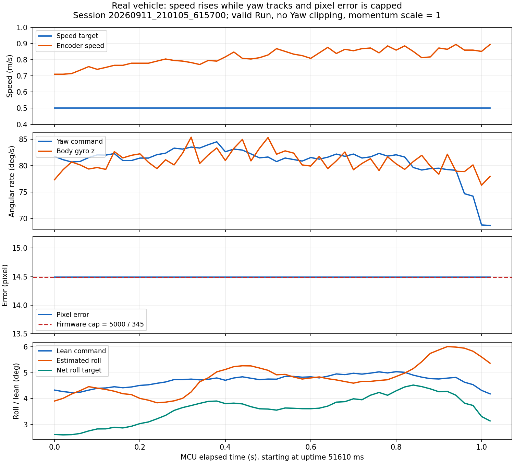

# 长弯超速与弯道外偏：日志和源码分析

日期：2026-09-12。下文保留修改前的日志与源码诊断。后续已实施 Pitch 角速度坐标修正，并将视觉加权偏差限幅从 5000 提高到 15000，见 [当前控制指南](../../../../控制调试指南.md)；积分上限尚未调整。下文 5000/14.493 等数值保留为修改前的诊断记录。原始数据不作为修正后的实车验证。先解决实际车速跟踪，再处理横向误差提前饱和；目前没有依据优先增大 Yaw PID、继续提高 pixel_kp 或扩大压弯角上限。

## 实车证据

使用 `C:/Users/kongmeng/Documents/EmbeddedStation/sessions/20260911_210105_615700/frames.jsonl`，transport=serial、COM3。共 7778 个 run 帧，其中 3217 帧 Run 有效。更新的 `20260912_003324_799300` 是 Mock，不用于判断实车。

进一步筛选 Run、Balance、Track Valid、视觉已应用、IPM 均有效，非 HOLD，视觉年龄 <100 ms，规划速度 >0.1 m/s，规划与斜坡差 <0.02 m/s，|转弯指令|>20°/s，得到 1906 帧。这代表目标速度已稳定的有效转弯样本，不代表车辆状态都已达到稳态。

- 这些转弯样本中，Yaw 请求/分配差超过 1 duty 的帧数为 0。
- 全部记录到的 Run 帧中 CH21 动量权限均为 1；不能把本批外偏主要归因于共模降权。
- 1906 帧中有 551 帧的 |CH14|>14.48 pixel，接近当前像素误差硬上限。
- 不对不同试车条件混合统计推断因果；缺失帧、未记录时段和保护前后的行为不能据此排除。

代表窗口：MCU uptime 51610～52630 ms，52 帧、1.02 s，见 [证据图](long_turn_evidence.png)、[统计](evidence.json)、[原始帧摘录](selected_frames.json)。PC 接收有集中到达现象，图按 MCU 时间绘制，不把 PC 接收时间当成控制采样间隔。

| 观测量 | 结果 |
|---|---|
| CH18 规划 / CH19 斜坡目标 | 都一直为 0.50 m/s |
| CH20 编码器速度 | 0.710 → 0.894 m/s，均值约 0.817 m/s |
| CH9 转弯指令 / CH10 gyro_z | 均值分别约 80.89 / 80.91°/s；末段有跟踪延迟 |
| CH11/CH12 Yaw 裁剪 | 无 |
| CH14 像素误差 | 全段 14.493 pixel |
| CH21 动量权限 | 全段 1 |

这段明确显示“实际轮速超过目标”，并非“规划主动加速”。CH20 来自编码器，不是独立地面测速；最终还需用视频/距离时间排除打滑或有效轮径变化。CH10 是机体系 gyro_z，压弯时不严格等于地面航向角变化率。日志没有同步的 pitch_rate、Pitch 目标、速度环 I 项和 C 电机输出，因此尚不能确定超速的全部来源。



## 速度问题：先修跨轴关系和慢偏差抑制

[control.c](../../../../code/control.c) 的 `run_speed_limit()` 会把规划目标限制在 Straight 以内，`speed_ramp_update()` 也不会主动越过当前目标。降 Curve 或调 Run Decel 改变的是目标，不保证真实速度立即受限。这段 CH18/19 恒为 0.5，因此不能靠重复降低规划参数解释或修复全部超速。

### Pitch 的欧拉角和机体系角速度混用

[attitude.c](../../../../code/attitude.c) 使用标准 ZYX 四元数转欧拉角，但 `attitude_update_rate()` 直接令 `att.pitch_rate=imu.gyro_y`。Pitch 串级外环使用 `att.pitch`，内环使用 `-att.pitch_rate+p_angle_pid.out`。

对于该欧拉角定义，实际关系为：

```text
pitch_dot = gyro_y*cos(roll) - gyro_z*sin(roll)
```

也就是说，侧倾转弯且真实 Pitch 不变化时，gyro_y 可以不为零。以 Roll=5°、gyro_z=80°/s 为例，恒定 Pitch 对应的 gyro_y 约为 `80*tan(5°)=7.0°/s`。直接把 gyro_y 当 pitch_dot，会让角度外环通过持久的角度误差补偿转弯耦合。该项符号由实际 roll、gyro_z 和现有电机方向共同决定，不能只凭公式断言每次都会加速。[VectorNav 的姿态运动学方程](https://www.vectornav.com/resources/inertial-navigation-primer/math-fundamentals/math-attitudetran)

本例中可从现有日志计算的 `|gyro_z*sin(roll)|` 从约 5.28 增至 7.29°/s；这是变换中的一项，不是实测的总 Pitch 误差。以读回的角度 Kp≈8，其量级可对应约 0.7～0.9°的外环偏差；这可能参与超速，但不足以证明日志中全部速度增量都来自这里。

优先程序改法：保留原始 p/q/r 给 Mahony 四元数解算，另给角度串级使用一致的角速度；可选择把测量转换为欧拉 Pitch rate，或者把 Pitch 外环的角速度命令转换成机体系 q 指令。不要把转换后的欧拉角速度再次送进原四元数积分。姿态用于三角函数时应采用坐标变换本身的 roll，不把机械平衡零点任意从 roll 中扣掉。变更需先验证静止、单轴运动和固定侧倾旋转，再做同速左右弯对照。

### 当前速度环的积分补偿很小

实际读回的 `p_vel_kp=0.056`、`p_vel_ki=0.001`；[board_config.h](../../../../code/board_config.h) 的 `P_VEL_IMAX=200` 限制的是累计误差，因此最大 I 输出只有 `0.001×200=0.2°`，不是 200°。这意味着 I 项抵消持续机械偏置/耦合的能力有限；是否实际顶住该上限尚需增加遥测确认。

建议把速度环积分限额明确表达为“最大 I 输出角度”，保留总 Pitch 目标 ±8°和条件积分抗饱和；先消除坐标耦合，再逐步分配 I 补偿范围。不要把速度 P、I 和三个 Pitch 环同时加大，也不要去掉全部限幅。当前每 20 ms 的积分没有显式 dt，调整 Ki 或调用周期必须据此换算。必要时增加下游执行器饱和反馈，防止速度环在 C 电机无余量时继续积累。

后续需要同步记录：速度计划/斜坡/实测、Pitch 估计角与目标、机体系 gyro_y、转换后的 pitch_dot、p_vel_pid.out_p/out_i/out、p_rate_pid.out、C 实际指令和饱和标志。现有 run 25 通道不能提供上述全部量，不能用缺失的数据宣布某个 PID 已饱和。

## 外偏问题：像素误差在大弯已经失去幅值信息

[image.c](../../../../code/image.c) 的 `image_update_direction_camera()` 把 60 行加权方向和夹到 ±5000；[control.c](../../../../code/control.c) 再除以权重和 345。所以用于方向 P 的反馈最多只有约 ±14.49 pixel。control.c 还有同一上限的夹取；只改其中一端无法恢复大误差信息。

当真实加权偏差已超过这个范围时，偏 15、25 或 40 像素都会被压到同一个输入。pixel_kp 从 2 增大到 3，只是把饱和反馈贡献从约 29°/s 放大到 43.5°/s，同时把直道中心附近的灵敏度也放大 50%。因此可能先出现直道左右摆头，却仍无法恢复大弯的误差分辨能力。

第一项针对性修改应是把过早的原始视觉夹取改为合理的图像几何边界，或直接传递未过早饱和的有效权重平均误差；保留总 Yaw 指令 ±120°/s、变化率、数值有效性和最终执行器限制。然后把 pixel_kp 调回直道稳定的水平。这样中心附近的小误差增益保持不变，大误差能继续增加纠偏请求。可进一步采用连续的大小误差增益调度，但不要用突变门控。

大弯还需要正确的前馈。当前 `direction_curve_kff * |v| * g_vision_curvature` 已经存在，不能说程序没有曲率前馈；问题是图像曲率使用归一化坐标，不是 1/m，经验 Kff 不能自动保证所需转弯率。理想几何前馈为：

```text
yaw_rate_ff[rad/s] = speed[m/s] * curvature[1/m]
```

将横向误差、路径航向和曲率统一在车体地面坐标及同一预瞄位置，先标定尺度和方向，再组合曲率前馈与横向/航向反馈。现有像素项是整幅加权，heading/curvature 则在 err_front_row 附近求值，二者预瞄位置不同；只调整前瞻行并不会等量移动像素项的取样区域。Pure Pursuit 是可评估的替代路径控制方案，但也需要有效几何和合适的预瞄距离，不能与现有前馈不加区分地重复叠加。[CMU 路径跟踪报告](https://www.ri.cmu.edu/pub_files/pub3/coulter_r_craig_1992_1/coulter_r_craig_1992_1.pdf)

## 压弯对视觉几何的影响也应单独核对

目前 IPM 使用静态矩阵，CPU1 没有用 Roll 做动态地面投影修正；Pitch 反馈主要供元素判断使用。即便原始车轮轨迹在中线附近，倾斜摄像头也可能使固定 IPM 下的中线、航向和曲率发生系统变化。

在同一物理位置固定行进轮接地点，拍摄直立、向左/右倾斜时的原图和 BEV，记录车体转动及摄像头平移，检查变换后的道路几何是否偏离已知标线。该试验区别“车辆真外偏”和“视觉认为偏了”。若偏差明显，再按摄像头内参、安装外参、旋转中心与地面平面更新投影；单纯减去一个与 Roll 成比例的像素数只可作局部近似，不能替代几何标定。该项目前是源码支持的风险，日志尚未证实其影响大小。

## 实施和调试优先级

1. 先锁定同一套压弯、零点与转向参数，在当前可控的低速下记录速度跟踪；本轮不要再提高 pixel_kp。
2. 优先统一 Pitch 角度/角速度坐标，增加必要的速度环/Pitch/C 输出诊断，核查 I 项补偿与执行器余量。不要通过截断测速值或直接关闭 C 电机来“限制速度”。
3. 恢复大偏差的视觉幅值信息，保留最终转向限制，并把直道小误差增益调回稳定值。原始中线错误、车轮打滑或已丢线时另行处理，不能靠放大错误反馈修正。
4. 在速度能跟住目标后标定曲率前馈，验证压弯下 IPM，并统一预瞄几何；不以更大的 pixel_kp 代替这些工作。
5. 加入与转弯能力相关的提前减速：用物理曲率求 `v_curve<=sqrt(a_lat_allowed/(|kappa|+epsilon))`，还可结合可用转弯率限制 `v_yaw<=r_available/(|kappa|+epsilon)`（r 用 rad/s），最终与基础速度取最小值，并保留减速斜坡。现有归一化曲率不能直接代入这两个 SI 公式。速度目标降低仍需 Pitch 实际跟踪才能生效。

相同转弯率 80°/s 下，理想几何半径在速度 0.5 m/s 时约 0.36 m，速度 0.8 m/s 时约 0.57 m。因此先控制实际速度，也是在直接解决弯道外偏。上述数字是运动学量级，不能把机体系 gyro_z、编码器速度和有侧滑的真实轨迹完全等同。

验收使用同一路段、同样起始条件和读回参数，比较连续有效弯道内速度误差是否持续累积、转弯率跟踪、真实中线偏差、原始/处理后像素误差、Yaw 裁剪、Roll 跟踪与单轮转速。软件结构问题可以从源码确认，具体超速原因和各项修改收益仍需新增遥测与实车对照。