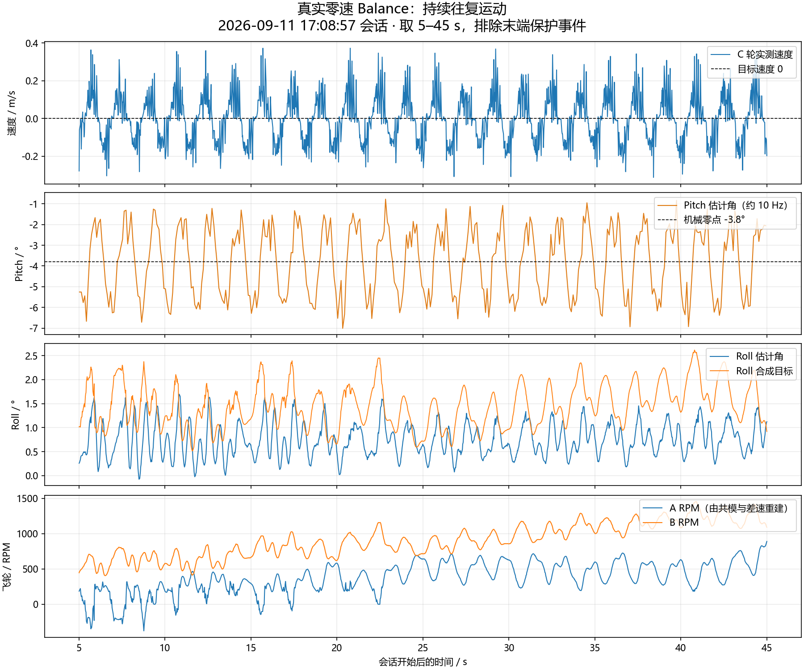

# 2026-09-11 Pitch 原地往复振荡：实车日志分析

本次只读取上位机会话和源码，未连接串口、未下发 PID、未修改固件。使用项目 develop-tc264-unicycle skill。日志来自 `C:/Users/kongmeng/Documents/EmbeddedStation/sessions/`，会话元数据为 serial / COM3 / tc264-cfg1-task1，包含 MCU 参数应答；不是 Mock。分析以读取时固定文件前缀为准，正在写入的日志随后可能继续增长。

## 结论

真实零速 Balance 中存在约 0.6 Hz（约 1.7 秒一周期）的明显往复振荡。稳态片段平均速度接近零，所以主要现象不是单向零点漂移。现有数据支持优先验证速度外环与姿态内环之间的动态配合，以及换向非线性；不能仅凭周期断言某个 Kp/Ki 过大。

此前增大速度环 P/I 的记录没有显示明确改善。建议先冻结机械零点与内环，用较小的速度环 I 做单变量对照；若无改善，再在支撑条件下隔离角度/角速度环。不要同时修改三个环，也不要直接清零全部 PID。

## 1. 最近有效片段与实际参数

会话 `20260911_170857_597700`，取会话内 5～45 s。该段 `stat` 均为 START_BALANCE=2、Run/Test/Jog 均为 0；`run` 也确认 Balance 有效、Run 未启用、斜坡速度目标为零。分析窗包含 1600 帧 run、400 帧 att。

| 参数 | MCU Schema 读回值（显示四舍五入） |
|---|---:|
| p_rate_kp / ki / kd | 20 / 0.5 / 0 |
| p_angle_kp / ki / kd | 5.6 / 0 / 0 |
| p_vel_kp / ki / kd | 0.065 / 0.004 / 0 |
| pitch_zero_init | −3.8° |
| odom_counts_per_m | 11695 |

这些值由本会话起始 Schema 确认，不是从 Profile 默认值猜测，也不证明已经保存 Flash。

| 指标 | 结果 |
|---|---:|
| C 轮平均速度 | +0.000028 m/s，几乎为零 |
| C 轮速度 RMS | 0.121 m/s |
| 速度 5%～95% 分位区间 | −0.188～+0.209 m/s |
| 速度最小/最大值 | −0.312 / +0.372 m/s |
| 低频主峰 | 约 0.600 Hz，周期约 1.666 s |
| Pitch 估计角 5%～95% 区间 | −6.24～−1.53° |
| Pitch 估计角最小/最大值 | −7.01 / −0.775° |
| 分析窗内最大单轮绝对 RPM | 约 1453 RPM |

速度是 C 编码器换算结果，不能排除轮胎打滑或机械传动影响；Pitch 是 IMU 估计角。没有外部视频，不把这些数值当成车架真实位移/真值姿态。平均速度几乎为零不意味着车轮静止，也不能据此精确校准机械零点。

同会话约 51.626 s，stat 从 Balance 转为 STOP，测试状态码为 8；按当前 `control.h` 为 Roll 超角保护，区别于 Pitch 超角（9）和飞轮超速（10）。末端出现较大 Roll 与异常高速编码器反馈，可能包含失稳、抬车或轮子空转；没有视频不能确定动作原因。因此主分析排除了这一末端，而不是把全会话峰值算进稳态振荡。

## 2. 已经做过的调参对照

会话 `20260911_160605_934300` 的 `rsp:...,ok,set,...,APPLIED` 确认：416.440 s，p_vel_kp=0.08 生效；448.133 s，p_vel_ki=0.006 生效。期间 Pitch 内环和角度环读回值保持不变，零点约 −4°。

| 会话内窗口 | 速度 Kp | 速度 Ki | 速度 RMS | Pitch 5%～95% 区间 |
|---|---:|---:|---:|---|
| 404～414 s | 0.065 | 0.004 | 0.107 m/s | −6.25～−1.43° |
| 437～447 s | 0.080 | 0.004 | 0.106 m/s | −6.38～−1.39° |
| 452～462 s | 0.080 | 0.006 | 0.110 m/s | −6.83～−0.98° |

这些是各 10 秒的探索性比较，启动条件和外部扰动未受控，不能用 1% 的差异认定优化有效，也不能严格证明增益增大必然恶化。可以得出的结论是：没有看到振荡显著收敛，继续提高 P/I 缺乏实测支持。

16:56:54 会话还记录了 Ki=0.008 生效，随后恢复 0.004；但相应 Balance 时段缺少 att/run 数据，不能只用参数应答判断其效果。

## 3. 当前代码对调参的含义

当前 Pitch 是速度（20 ms）→角度（5 ms）→角速度（1 ms）串级。角速度为增量式 PID，速度为带限幅的位置式 PID；增益使用每拍离散误差，没有显式 dt 换算。不要直接抄连续 PID 的数值。

- 速度环输出是叠加到 pitch_zero 的倾角目标，限 ±8°。
- 默认/本次读回 Ki=0.004；积分累计量硬限 200，所以积分倾角贡献最多 ±0.8°。这不是速度环总输出限幅。
- 在 0.1 m/s 的固定速度误差下，当前标定对应约 23.39 count/20 ms。积分若从零开始且无冻结，约 0.17 s 即可累到上限。该计算不代表日志已测得积分撞限，但说明 0.004 并非可以忽略。
- Kp=0.065 时，0.2 m/s 的速度误差单靠比例项就会要求约 3.04° 倾角修正。速度环能明显驱动车架前后摆动。
- C 驱动对非零输出加 ±120 duty 死区补偿，换向还受轮胎、减速机构间隙及静摩擦影响。可能形成低速往复，但缺少 C 输出日志，尚未证明是主因。
- 独立 Balance 有速度环；Pitch Angle 测试会清零/旁路速度环。测试模式不同，不能把两者的漂移直接当成 PID 好坏。

串级控制的一般要求是内环比外环响应快；控制执行频率高不自动等于实际闭环带宽高。调参时应先确认内环稳定，再整定外环。[MathWorks：串级 PI 控制设计](https://www.mathworks.com/help/control/ug/designing-cascade-control-system-with-pi-controllers.html)

## 4. 建议的实车试验表

保留当前可运行参数快照，使用相同配重、轮胎、地面、相近电压和起始姿态。每次正式比较前确认当前参数仍是表中基线。静态试验先保持 pitch_zero，不再边试边改零点。使用保护架/防跌措施；限位应尽量不承重，外部支撑会改变动态，必须记录。

### 第一步：削弱速度环积分，验证外环是否在持续推摆

| 试验 | 只修改这一项 | 其余要求 |
|---|---|---|
| A 基线 | 不改 | Kp=0.065，Ki=0.004，Kd=0 |
| B | p_vel_ki：0.004→0.002 | 内环、角度环、机械零点不变 |
| C（条件试验） | p_vel_ki：0.002→0 | 仅在 B 可控、支撑条件下短时检查；可能增加漂移，不作为最终参数 |

每次观察约 15～20 s，接近保护、移动范围扩大或振荡增长时提前停止，不等待倒车。每个条件重复 3 次，剔除起始 2～3 s；若有初始慢过程，则延长稳定等待而不强行纳入统计。比较速度 RMS、Pitch 波动宽度、平均速度和转速余量。

若 I 减小时摆幅明显下降，但平均速度偏移增加，说明需要分开处理动态稳定与静态偏置；后续校准零点或保留较小积分，不通过重新加大 I 强行消除所有漂移。若振荡变大或恢复明显变差，退回基线，不继续沿减小 I 的方向试。

### 第二步：只有外环仍呈周期性追赶时，再减小速度 P

基于上一步表现更好的 Ki，单独把 p_vel_kp 从 0.065 降为 0.055；若可控且有明确改善，再考虑 0.045。不要在同一次试验同时改 P 和 I。若推车后明显拉不住或摆幅持续增大，恢复原值。Kd 保持 0，暂不以速度 D 掩盖问题。

这些数值是小范围辨识试验点，不是通过日志辨识得到的最优 PID，也没有在本车验证过。

### 第三步：若减弱速度环没有改善，隔离角度与角速度环

在可限制前后位移、避免跌倒的条件下，使用 Pitch Angle 测试隔离速度环；它不保证定点停车，不能让车自由跑。若无速度环仍反复摆动，则优先检查角度/角速度环、估计器、编码器与机械换向。

当前角度 P=5.6，可在内环已确认可控的前提下，以 5.0 做一次小幅减小的对照；如果动作变迟钝且恢复更差就恢复。此时不同时改变 Rate 参数。Rate=20/0.5/0 暂保留，缺少内环反馈时无法可靠决定它的 Kp 应增还是减。不要直接将 Rate Ki 清零，也不要盲目添加高频 D。

最终从已稳定的角速度环向外依次验证角度环、速度环。单看自由原地前后移动，无法完成角速度环的独立整定。

## 5. 下一份日志需要什么

已有记录足以证明低频振荡，但缺少 Pitch 目标、Pitch 角速度、C 电机输出、速度环 P/I 分项，不能判断目标先振荡还是姿态内环跟踪失稳。

优先保留：时间戳、模式、目标/实际速度、Pitch 估计角/目标角/角速度、速度环 P/I 输出、C 输出、参数修改应答。需要验证 1 ms 内环时，应设计更高频的专用采样；现有 att 约 10 Hz 不能排除高频抖动。若后续增加固件诊断，先预算 115200 串口带宽，用可切换的 Pitch 专用通道，不无限追加现有 run 字段。本次未改遥测协议。

本次 run 约 40 帧/s，MCU 时间戳常见间隔 20/40 ms，相比 nominal 20 ms 采样缺约 20% 的位置。没有补零；频谱使用 MCU 时间线线性插值到 20 ms，再作去趋势 Hann 周期图，仅在 0.2～4 Hz 范围寻找主峰。该主峰不等于已辨识的系统固有频率。att 无 MCU 时间戳，图中按 PC 接收时间叠放，不能据此精确辨识环间时延。上位机缺帧不能直接推断 1 ms 控制器停顿。

## 6. 可复核产物

- [metrics.json](metrics.json)：窗口、参数标签、样本数、统计与原始文件前缀长度。
- [latest_balance.png](latest_balance.png)：最新稳定片段曲线。
- `*_run.csv`：分析窗口的原始 run 数值与 PC 接收时间；列序对应 CH0～24。
- [analyze.py](analyze.py)：只读重算脚本；重跑会读取届时日志前缀，原文件增长时 manifest 会变化。

分析脚本检查了选定窗内 stat 模式、Run/Balance 状态位、零速度目标和 MCU 时间单调性；曲线已视觉核验。没有执行实车调参、没有根据这些短时样本宣称找到最优参数。