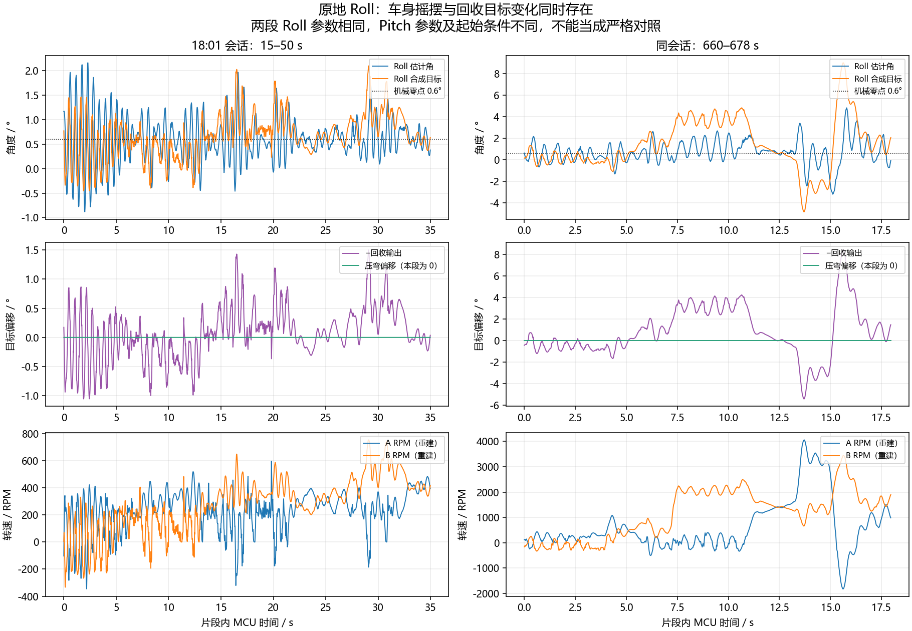

# 2026-09-11 Roll 原地与赛道低频摇摆：日志分析及调参顺序

本次读取用户文档目录 EmbeddedStation/sessions 中新增的实车串口会话，重点分析 `20260911_175605_792100` 和 `20260911_180126_149700`。原始日志只读；未连接串口、未修改车上参数、未改固件。依据当前项目 skill、control.c / pid.c 的实际实现，不沿用 Pitch 的积分调试结论。

## 1. 结论

连续原地记录中存在约 1.6～1.8 Hz（每周期约 0.55～0.63 s）的 Roll 摆动，还叠加了更慢的回收目标变化。Roll 的回收、角度、角速度三环 I 均为 0，因此不能把本次问题简单归因为积分过大。

当前可验证的事实是：回收输出使目标在摆动，车身对目标也存在跟踪误差。两者处在同一个闭环，波形相关和同频不能证明一定由回收先引起。优先做小幅降低回收 P 的对照，并根据目标与实际角的变化决定是否进一步整定角度/角速度环。不要继续同时加大 Rate P、D。

已有原地摆动片段中，飞轮转速和 Roll duty 尚未达到软件限幅。因此“已经飞轮饱和”不是这些片段内摆动的必要条件；但后续大目标、持续轮速积累仍会占用跑车余量。未记录驱动电流，不能据此保证驱动实际扭矩从未受限。

## 2. 实际参数与波形

最新会话已读回的 Roll 参数：

| 环节 | 参数值 |
|---|---|
| 回收 | r_rcy_kp=0.0016，I=0，D=0 |
| 角度 | r_angle_kp≈36，I=0，D=0 |
| 角速度 | r_rate_kp=−18，I=0，D=−7.5 |
| Roll 机械零点 | 0.6° |
| 飞轮软件超速阈值 | 8000 RPM |

上表来自对应片段前的 MCU Schema，不能当作用户之后尚未记录的实时参数。

最新会话中选取两段：均由 run 状态位确认 Balance 有效、Run 关闭、速度斜坡目标为 0、压弯偏移为 0。回收输出与 `0.0016×(A−B)` 一致到输出小数精度，合成目标与 `0.6−回收输出` 一致。

| 指标 | 会话 15～50 s | 会话 660～678 s |
|---|---:|---:|
| Roll 估计角 5%～95% 区间 | −0.23～1.41° | −0.81～2.48° |
| Roll 目标 5%～95% 区间 | −0.13～1.40° | −2.42～5.12° |
| 目标跟踪误差 RMS | 0.56° | 2.28° |
| Roll 角速度 RMS | 5.04°/s | 9.13°/s |
| 主摆动频率 | 1.83 Hz | 1.67 Hz |
| 最大单轮绝对转速（重建） | 753 RPM | 4059 RPM |
| 最大 Roll 输出绝对值 | 1165 / 10000 | 5188 / 10000 |

两段 Roll 参数相同，但 Pitch 参数、初始轮速、外部扰动可能不同，不能据此归因到某一个改动，也不能把后段的慢趋势当作已证实的稳定周期。没有视频排除推车或扶车影响。



## 3. 已做过的 Rate 改参并没有给出明确解法

17:56:05 会话中，MCU 应答确认改参实际生效。下表选择改参后的原地窗口，Pitch 参数相同，但时长、起始条件不同；它是探索性对照，不是严格实验。

| Rate P / D | 窗口 | Roll 90% 波动宽度 | 角速度 RMS | 目标跟踪误差 RMS |
|---|---|---:|---:|---:|
| −18 / −7.5 | 10～40 s | 1.94° | 5.92°/s | 0.66° |
| −20 / −7.5 | 65～80 s | 1.60° | 6.22°/s | 0.62° |
| −18 / −10 | 133～145 s | 1.95° | 5.95°/s | 0.64° |

−20 时角度宽度略小，但角速度 RMS 没降；D 改到 −10 时也没看到明显改善。−25 / −10 的连续试验太短且同时改了两项，不用于定论。不能说这些参数必然更差，但没有证据继续沿“P/D 绝对值越大越好”调整。

## 4. 为什么要先区分目标摆与姿态摆

原地时：

```text
回收输出 = r_rcy_kp × (RPM_A − RPM_B)       （当前 I=D=0）
Roll 目标 = roll_zero − 回收输出          （原地压弯为 0，另有总限幅）
```

当前 1000 RPM 差速就改变目标 1.6°，3000 RPM 对应 4.8°。回收既承担轮速管理，也直接给姿态环下达倾斜目标，不能只追求回收快而忽略目标幅度和闭环阻尼。

| 波形现象 | 优先验证方向 |
|---|---|
| CH5 回收和 CH2 目标明显摆动，车身跟着摆 | 回收与姿态环配合、反馈时效；先降低回收 P 做对照 |
| CH2 比较平稳，CH1 围绕目标持续摆动 | 角度/角速度环阻尼、执行器及姿态测量 |
| CH2 幅度变小，但 CH1 摆动不减或轮速持续爬升 | 不继续减回收；检查姿态内环和零点 |
| 平均 Roll 偏置且 A/B 差速长期同号累积 | 机械零点、重心、轴向和驱动差异；不要靠增大回收硬顶 |
| 原地改善、入弯仍明显摆动 | 再单独检查压弯、视觉转向、Yaw 裁剪与弯速 |

这些判断用于安排干预试验，不把闭环波形的先后或相关性当作充分因果证据。

## 5. 推荐调试步骤

### A. 固定 Pitch 和零点，先做一项小幅回收对照

保存当前已能运行的参数，固定 Pitch、Yaw、Roll 零点和机械布局。每次在相近电压、相近初始 A/B 轮速下，从完整 Balance 开始记录。不要通过跑一次赛道来比较原地调参。

只把 **r_rcy_kp 从 0.0016 降到 0.0013**；I/D 保持 0，Angle 36、Rate −18/0/−7.5 不变。首次短时观察约 10～15 s，在防跌措施下进行；如果摆动增长、车身偏移明显或轮速持续爬升，提前停止并恢复。有效片段可延长到 15～20 s，同条件至少重复三次。

比较 CH1 波动宽度、CH1−CH2 误差、CH3 角速度、CH5 回收幅度，以及重建的 A/B 转速趋势。减小回收 P 会直接缩小同一差速下的 CH5，所以仅 CH5 变小不算成功；必须车身摆动也减少，且轮速管理不恶化。

若改善可重复、回收仍有效，可下一次单独试 0.0011。不要直接关掉回收，也不要只因车身暂时不摆就接受轮速不断增长。

### B. 若回收减弱没有改善，恢复后检查姿态环

可以先恢复 r_rcy_kp=0.0016，单独将 **r_angle_kp：36→32** 做小幅对照，Rate 参数保持不变。若目标相对平稳时车身过冲减少、恢复能力仍正常，才考虑采用；若反应迟钝、撑不住或平均偏离目标明显，就恢复 36。不要在同一试验同时减回收 P 和角度 P。

更清晰的隔离方法是在支撑条件下使用 **Roll Angle Test**：源码会旁路/清零回收，保留 Roll 角度和角速度环。此模式不等于完整三轴 Balance，必须约束前后倾倒且尽量让支撑不干预 Roll；飞轮初始转速要低，只做短时检查，不用于跑赛道。

- Angle Test 仍摆：重点整定姿态内环或查机械/传感器，不能继续只改回收。
- Angle Test 能收敛、加回回收才摆：再整定回收响应，让它慢于姿态恢复。

这里只是诊断顺序。完整串级整定遵循内环先稳定，再整定外环；1 ms/5 ms/20 ms 的执行周期不等于实测闭环带宽。[MathWorks 串级控制设计](https://www.mathworks.com/help/control/ug/designing-cascade-control-system-with-pi-controllers.html)

### C. Rate 不再成组大幅改动

当前 Rate 的 P/D 为负是本车既定符号，保持符号。−18→−20 是增大绝对值，−7.5→−10 同样是增大 D 绝对值，不是“变小”。不要因为通用 PID 经验而改成正数。

本项目 D 使用每拍误差差值，且 Rate 误差包含角度环输出；角度目标/误差变化也会影响 D。因此“左右慢摆就加 D”不能保证增加有效阻尼，可能增加脉冲和噪声。现有 −10 的试验也未显示明显改善。没有隔离内环或更高频的执行器数据，不给出更激进的 Rate 参数。

### D. 原地收敛后，再单独处理跑车

恢复同一组可控的低速 Run 条件，先保持已有压弯参数，不边跑边加 Lean Kp。比较 CH7 压弯、CH5 回收、CH2 净目标，以及 CH11/12 Yaw 请求/实际分配。

跑车时目标为 `roll_zero + LEAN_DIR×lean − recovery`。若 CH7 随转向来回切换，或与回收互相抵消后又反向，优先检查压弯触发/时序、转向需求和弯速，不能让 Roll PID 独自补救所有目标问题。相同实际速度、路线、初始轮速下验证，否则低速带来的改善不能归因于 PID。

## 6. 赛道记录的限制

18:01 会话有约 130.9～183.1 s、763.3～815.6 s 的 Run 状态，但 run 波形集中在开头和结尾。140～175 s、770～800 s 没有有效 run 帧。17:23 会话的多次跑车也以碎片为主。记录能证明跑车发生、部分目标和回收变化，但不支持整段赛道的主频、稳态幅值或精确环间时延分析。

PC 收到一串密集样本可能是缓冲后到达，分析频率应使用 MCU 时间戳。通信缺口不自动证明控制 ISR 停顿。本次原地窗口 MCU 间隔最大 40 ms，后段有 73 ms 缺口，使用 MCU 时间线插值和 0.15～3 Hz Hann 周期图寻找低频峰；不补零，不跨长时间缺口连接频谱。频率数字是选定片段特征，不是已辨识的系统固有频率。

## 7. 产物与验证

- [metrics.json](metrics.json)：实际参数、时间窗、统计、输入前缀和改参应答。
- [roll_balance.png](roll_balance.png)：两段真实零速 Balance 的曲线；图中时间使用 MCU 时钟。
- `*.csv`：所选片段的 PC 时间与 run CH0～24。
- [analyze.py](analyze.py)：只读分析脚本；重跑会读取届时日志前缀。

脚本检查 Balance/Run 标志、零速目标、零压弯、MCU 时间单调性及回收/目标公式一致性，曲线已视觉核验。没有下发试验参数，上述 0.0013、0.0011、32 是单变量试验点，不是已验证的最佳 PID。